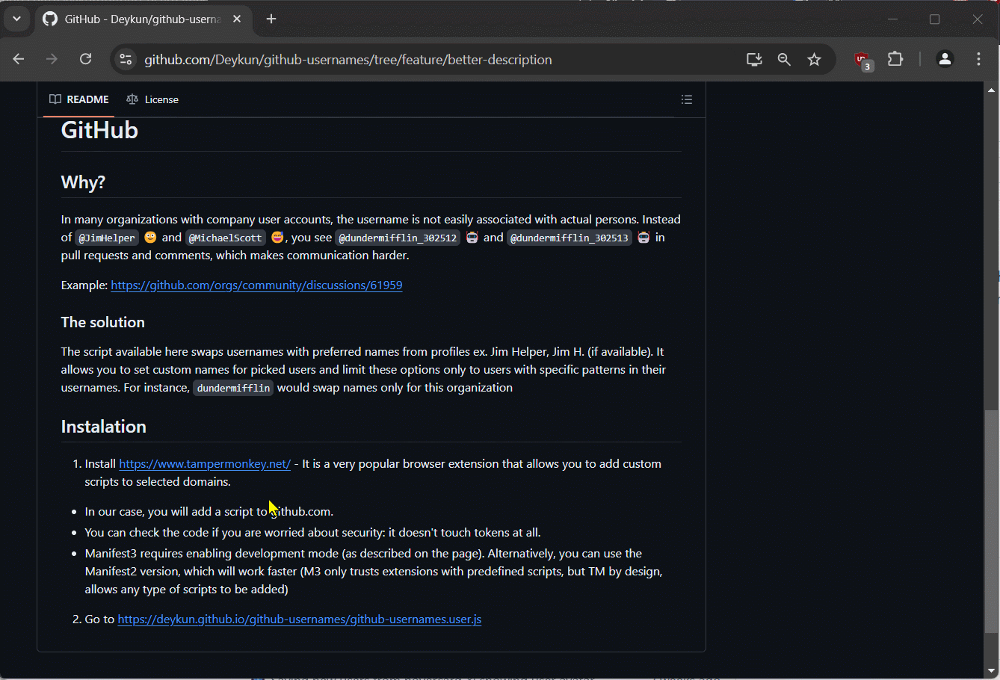

# User profile names instead of usernames on GitHub

## Why?

In many organizations with company user accounts, the username is not easily associated with actual people. Instead of `@JimHelper` 🙂 and `@MichaelScott` 😅, you see `@dundermifflin_302512` 🤖 and `@dundermifflin_302513` 🤖 in pull requests and comments, which makes communication harder.

Example:
https://github.com/orgs/community/discussions/61959

### The solution

The script available here swaps usernames with preferred names from profiles ex. Jim Helper, Jim H. (if available). It allows you to set custom names for picked users and limit these options only to users with specific patterns in their usernames. For instance limit to `dundermifflin` would swap names only for this organization.

## Instalation

1. Install https://www.tampermonkey.net/ - It is a very popular browser extension that allows you to add custom scripts to selected domains.

- In our case, you will add a script to github.com.
- You can check the code if you are worried about security: it doesn't touch tokens at all.
- Manifest3 requires enabling development mode (as described on the page). Alternatively, you can use the Manifest2 version, which will work faster (M3 only trusts extensions with predefined scripts, but TM by design, allows any type of scripts to be added)

2. Go to https://deykun.github.io/github-usernames/github-usernames.user.js

### Saving users names

To add user data, hover over their username and wait for the card (script grabs the username from the visible card). **But,** that sounds like a lot of work! Right, go to your organization's people page, and it will read 30 users at once from there. :)

To edit a user's display name, go to their profile page. You will have an additional option there.
